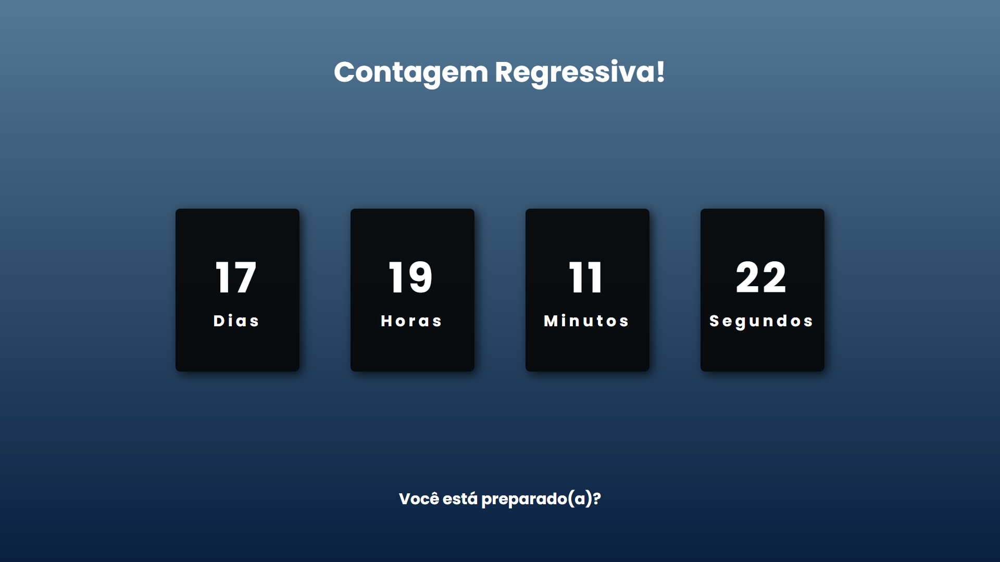

# Contagem Regressiva

Uma simples página HTML que exibe uma contagem regressiva até uma data específica.

## Demonstração

-Desktop


<br>

-Mobile


Você pode visualizar a página em ação [clicando aqui](https://codeclayton.github.io/Contador-Regressivo/index.html).

## Tecnologias Utilizadas

- HTML5
- CSS3 (com o framework Bootstrap)
- JavaScript

## Como Usar

1. Clone este repositório:
   ```bash
   git clone https://github.com/seu_usuario/contagem-regressiva.git

2. Abra o arquivo index.html:

## Contato

Sinta-se Livre para utilizar o código!